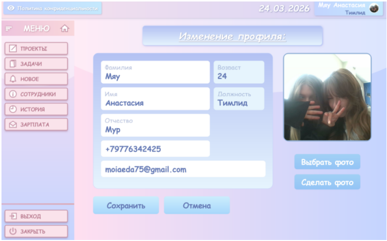
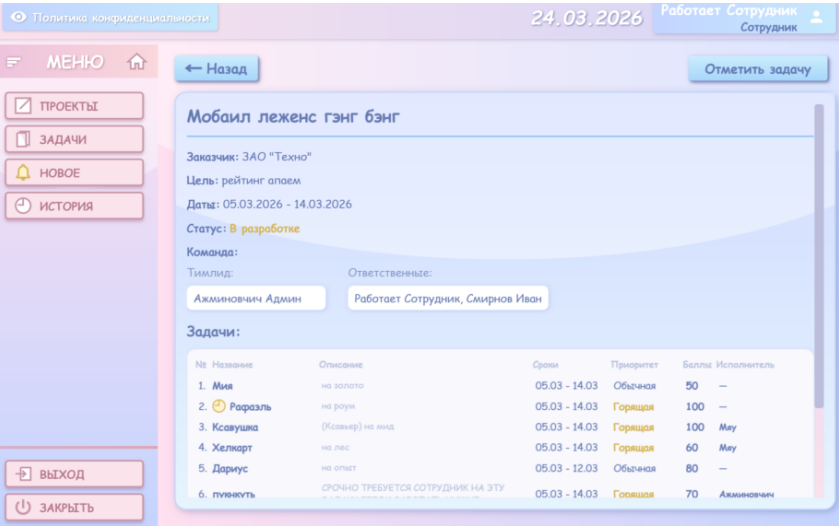

# Разработка программного обеспечения для распределения задач сотрудников

Курсовая работа на тему: «Разработка программного обеспечения для распределения задач сотрудников»

## Описание проекта
Данная программа - это удобное приложение для автоматизации работы сотрудников компании ООО «Айти-Системы». Приложение решает проблемы отчетности, расчета заработной платы и обеспечивает централизованный учет архивных данных о проектах.

Система поддерживает ролевую модель: **Сотрудник**, **Тимлид** и **Администратор**.

## Технологии
- **Язык / платформа:** C#, WPF
- **СУБД:** PostgreSQL
- **Инструменты:** Visual Studio 2022, pgAdmin 4

## Как развернуть и запустить проект

### 1. Установить необходимое ПО
- Установить [Visual Studio Community](https://visualstudio.microsoft.com/ru/) (выбрать нагрузку «.NET Desktop Development»).
- Установить [pgAdmin 4](https://www.pgadmin.org/download/) (или другой клиент для PostgreSQL).

### 2. Развернуть базу данных
- Открыть pgAdmin 4 и подключиться к вашему серверу PostgreSQL.
- Создать новую базу данных (например, `TasksDB`).
- Нажать правой кнопкой мыши на базу -> **Query Tool**.
- Открыть файл `database.sql` из репозитория.
- Нажать кнопку **«Execute»** (значок Play).

### 3. Открыть проект в Visual Studio
- Скачать репозиторий: нажать на GitHub **«Code» → «Download ZIP»**.
- Открыть файл `*.sln` в Visual Studio.
- В файле конфигурации (например, `App.config`) проверить строку подключения к PostgreSQL.
- Нажать **F5** для запуска проекта.

### 4. Работа с программой
- **Вход:** после запуска откроется окно выбора языка, затем окно авторизации. Введите логин и пароль (предусмотрена функция «Забыли пароль»).
- **Главный экран:** после входа отображаются предстоящие задачи на ближайшее время.
- **Для Тимлидов/Администраторов:** для создания проекта перейдите на вкладку «Проекты» -> «Добавить проект» -> заполните поля -> Сохранить.
- **Для сотрудников:** чтобы отметить задачу, перейдите на вкладку «Задачи» -> «Завершить задачу» -> выберите выполненные -> «Готово».
- **Для тимлида:** для расчета ЗП перейдите на вкладку «Зарплата» -> «Получить расчетный лист» -> проверьте данные -> «Отправить сотруднику» (Email) / «Сохранить в файл».

## Скриншоты

## Автор
Иванюта Анастасия Николаевна, 1232, ГБПОУ МО «Серпуховский колледж»
